# Agente n8n para classificação de solicitações de compra em SAP

Esse agente automatiza o processo de leitura, pré-processamento e classificação de solicitações de compras via email, simulando um ambiente corporativo com o sistema ERP SAP.

## Inicialização do projeto

`cd python_service`

`pip install -r requirements.txt -r requirements-dev.txt`

`docker compose build --no-cache`

`docker compose up -d`

Abrir url do cloudflare para acessar n8n.

# Fluxo do agente

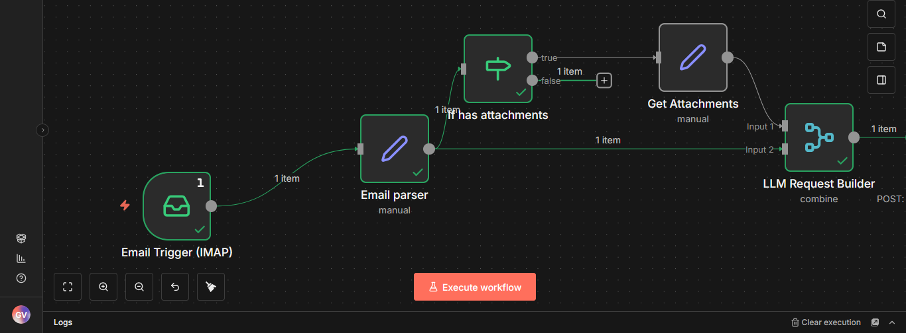

**Nó Email Trigger IMAP**: Lê emails recebidos e inicializa a automação

**Nó Email parser**: Captura assunto, email de quem solicitou e corpo do email.

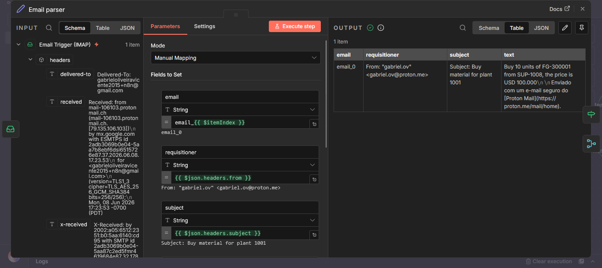

**Nó If has attachments**: Verifica se o email tem anexos: se sim, lê anexo.

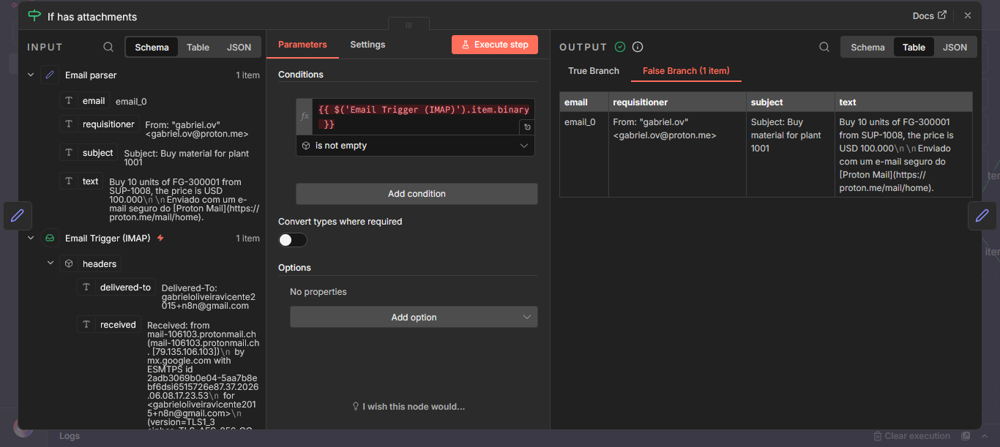

**Nó Get attachments**: Captura os binários do email (anexos)

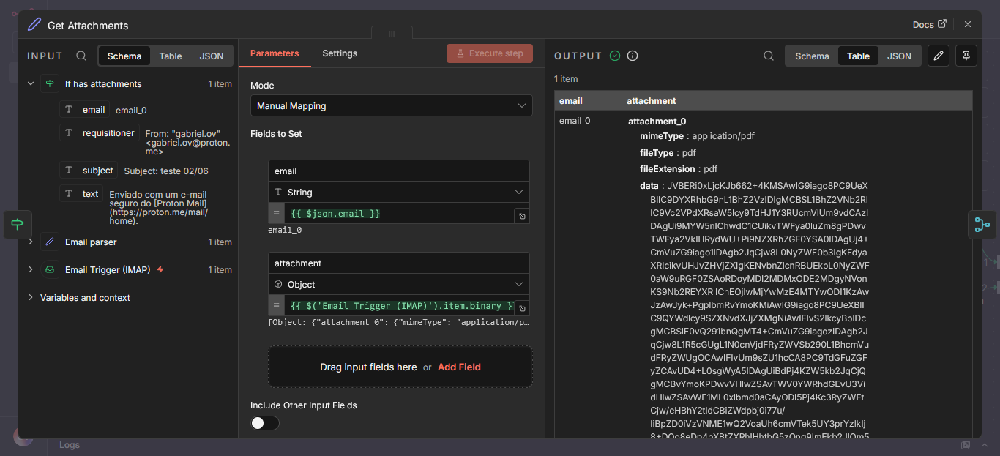

**Nó LLM Request Builder**: Combina as duas opções (email com anexo e email sem anexo) e monta um JSON estruturado

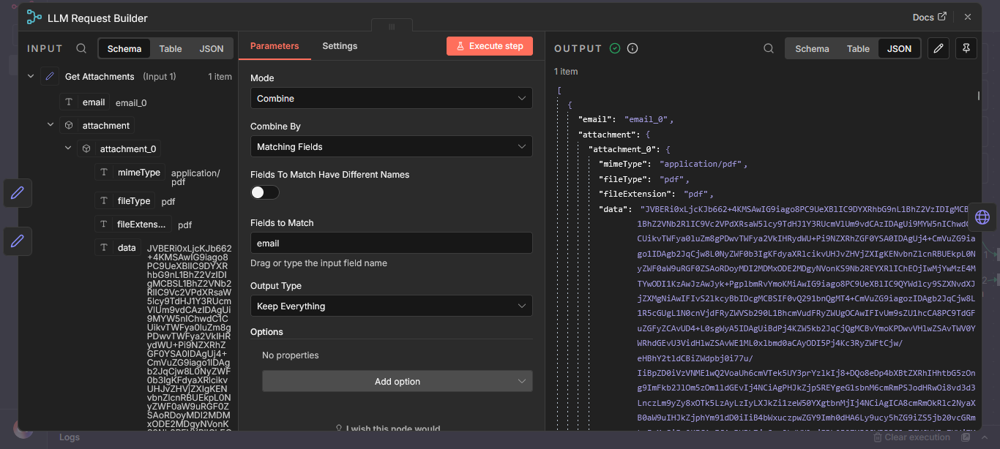

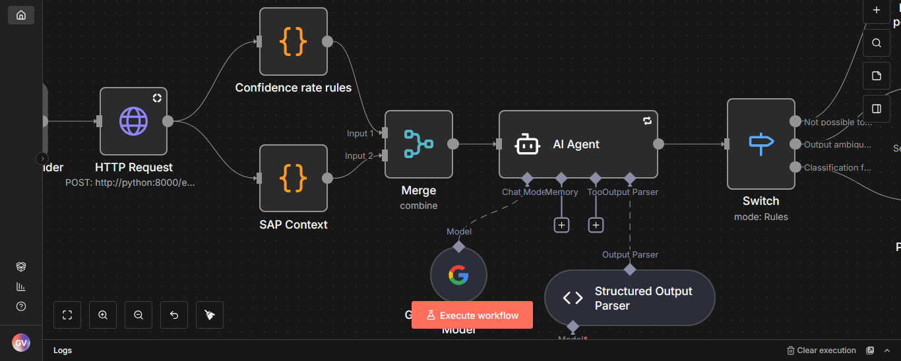

**Nó HTTP Request**: POST /python:8080/emailProcessingService, realiza pré-processamento do email:

* Route /emailProcessingService

  **Helpers:**

* Function **process_email_batch**
* Function **_process_single_email**
* Function **_extract_email_address**
* Function **_clean_subject**
* Function **remove_email_footer**
* Function **_process_attachments**
* Function **_build_attachment_preview**: Retorna primeiros 5000 bytes do anexo para resumo
* Function **_decobe_base_64**
* Function **_extract_pdf_preview**

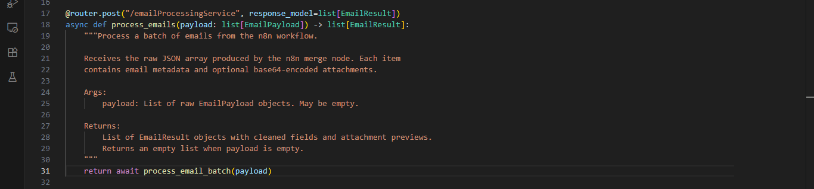
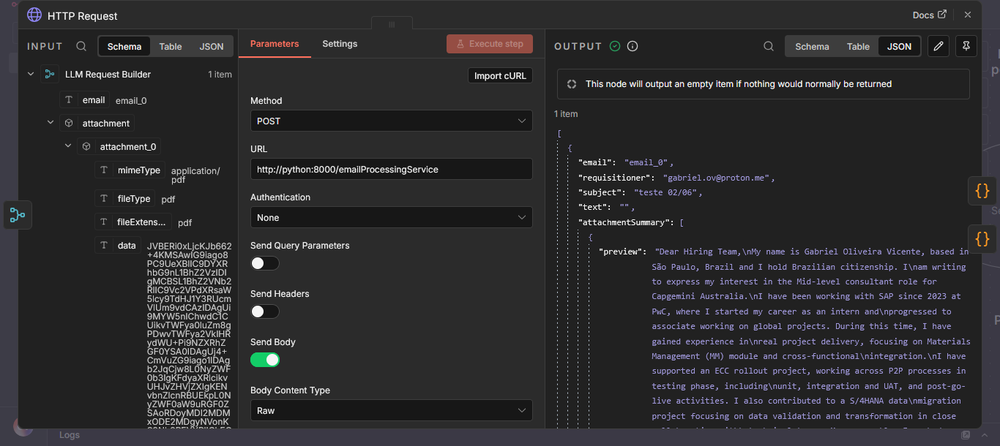

**Contexto SAP e regras para nível de confiança da resposta**: Nó que armazena de forma simples as regras que o Agente deve seguir

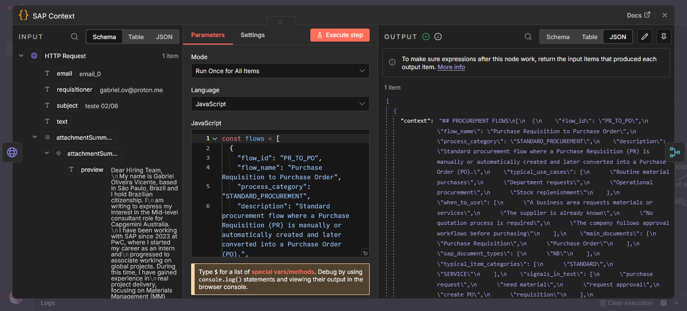
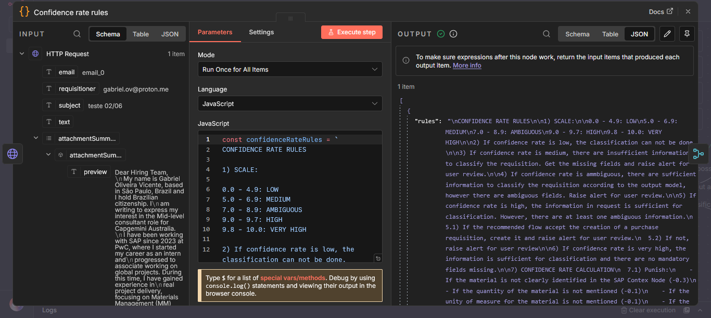

**Nó Agente de IA**: Modelo Gemini 3.1-flash-lite

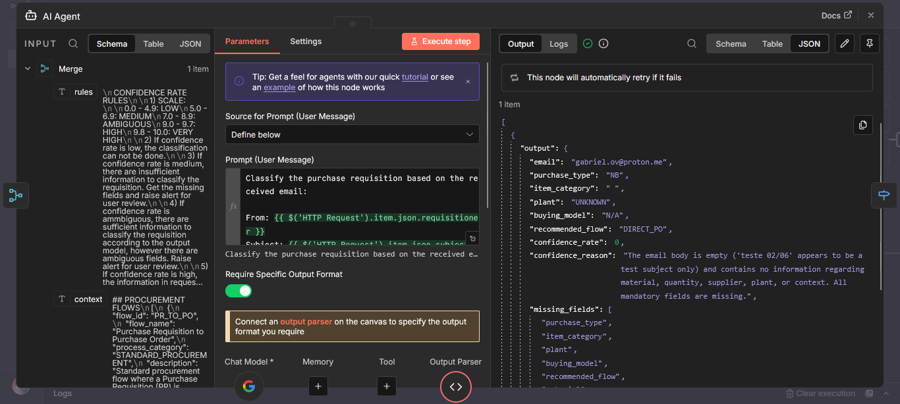

**Structured output parser**: Nó que itera pelo modelo de LLM para estruturar resposta de acordo com as regras

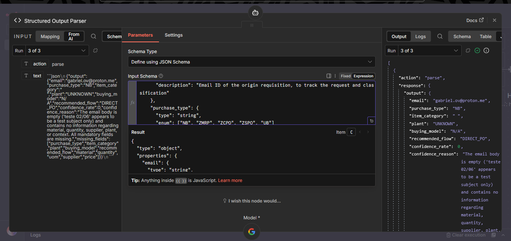

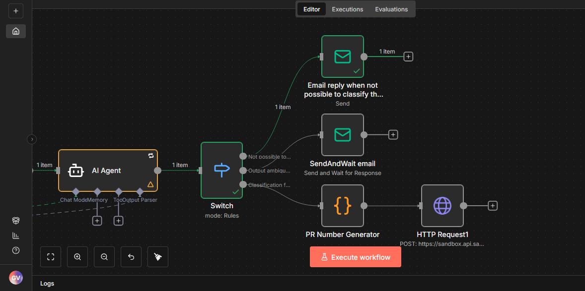

**Nó Switch**: Com base no nível de certeza, esse switch redireciona o fluxo para as melhores ações no momento: responder email pedindo mais informações, pedindo confirmação e aprovação ou enviando o ouput para a API do SAP, para processamento da solicitação de compra.

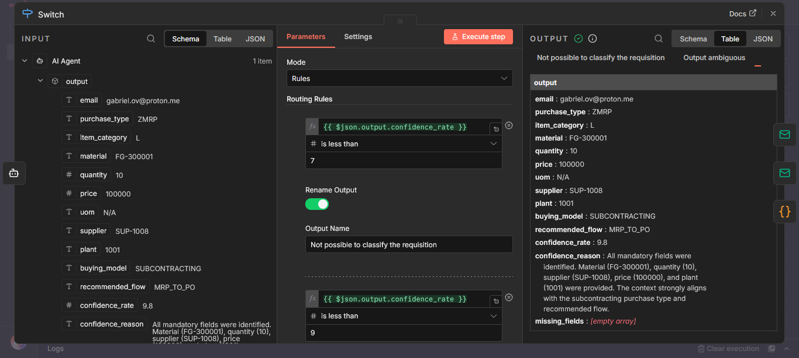

**Nó Send Email**: Com base no roteamento do switch, o fluxo envia um email para o remetente original pedindo mais informações para completar a classificação.

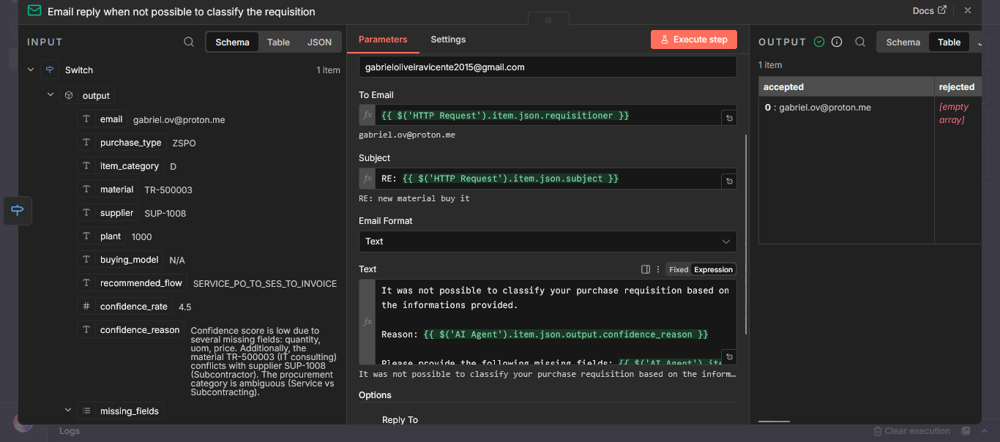
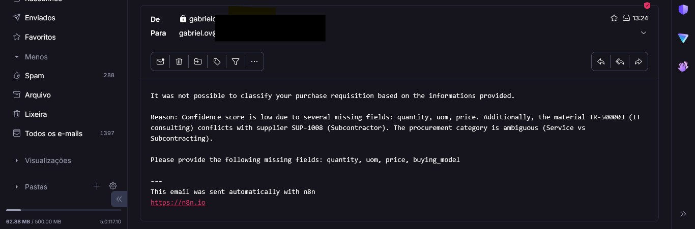